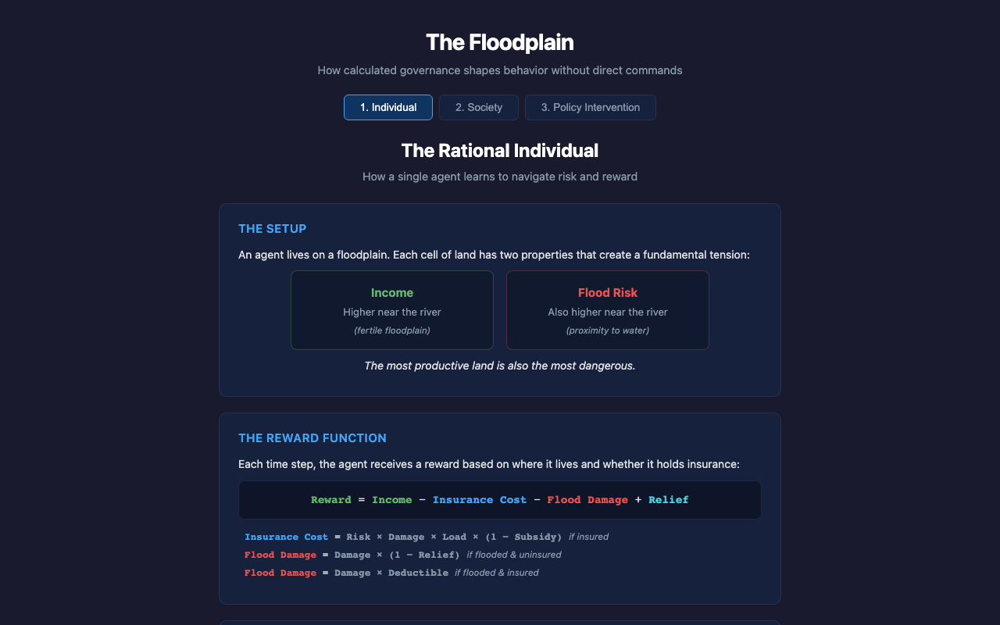
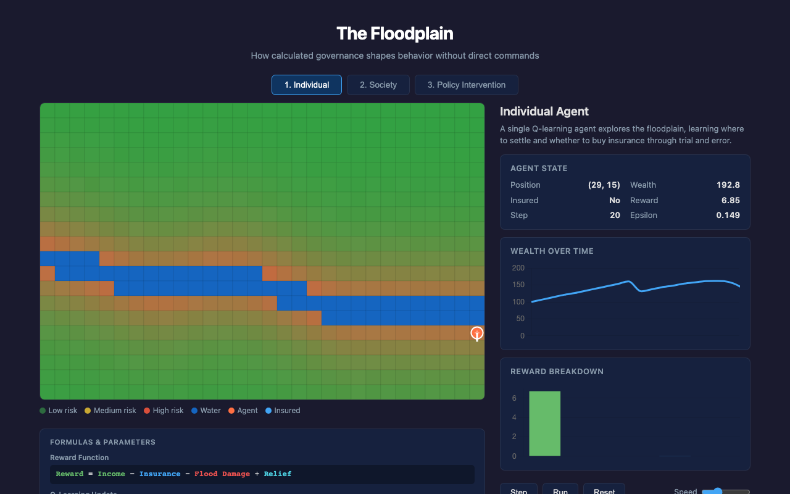
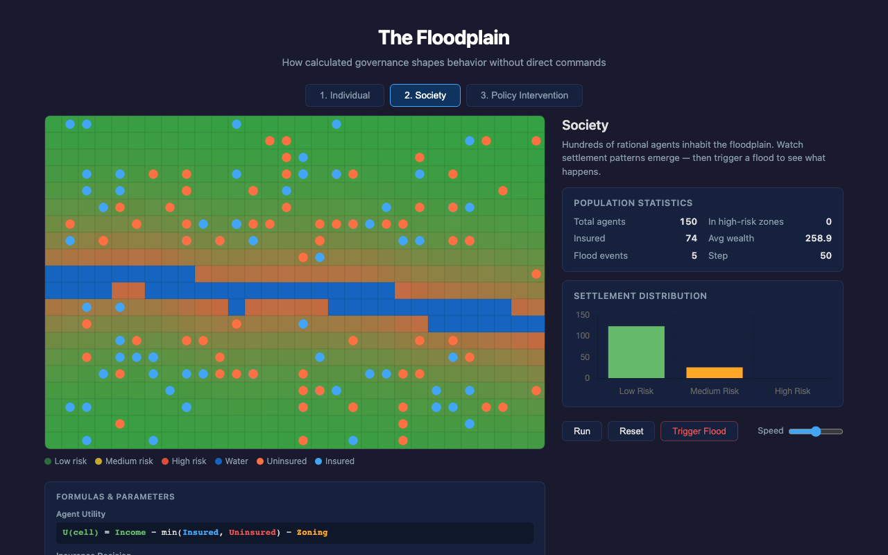
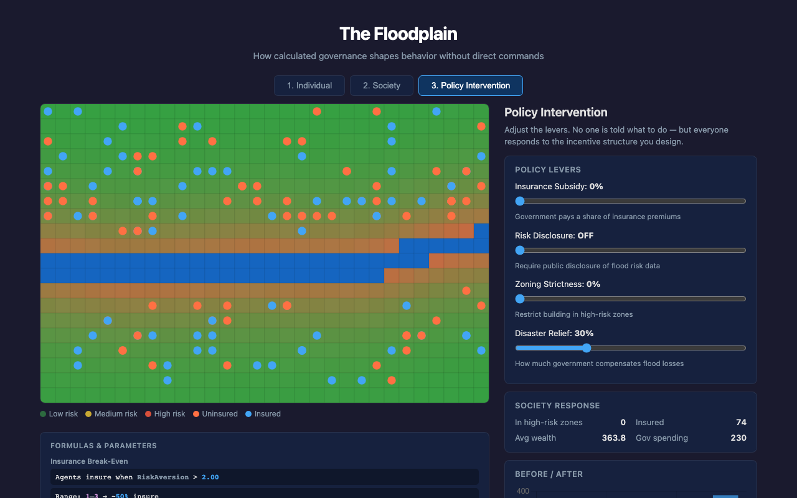

# The Floodplain

**How calculated governance shapes behavior without direct commands.**

An interactive simulation connecting reinforcement learning with economic models, built for an environmental study class on governing disaster. Inspired by Rose & Miller's concept of "governing at a distance" and Collier's work on flood insurance policy.

## Overview

The simulation progresses through three views, each building on the last:

1. **Individual** — A single Q-learning agent discovers where to live and whether to buy insurance through trial and error
2. **Society** — 150 utility-based agents produce emergent settlement patterns with no central planner
3. **Policy Intervention** — Interactive sliders let you reshape incentives and watch the population respond in real time

The core idea: nobody is told what to do. The **structure of incentives** does the governing.

## Screenshots

### 1. Individual — Explainer

Each view begins with an explainer screen that presents the underlying formulas and key concepts before the simulation starts.



### 2. Individual — Simulation

A single Q-learning agent explores the floodplain. White arrows show learned Q-values for each direction. The agent balances income (higher near the river) against flood risk.



### 3. Society — Simulation

150 independent agents share the floodplain. Blue dots are insured, orange are uninsured. Settlement clusters emerge naturally from individual rational choices.



### 4. Policy Intervention

Four policy levers (insurance subsidy, risk disclosure, zoning strictness, disaster relief) let you reshape the incentive landscape. The formula panel shows the insurance break-even point updating in real time.



## Key Mechanics

| Concept | Implementation |
|---|---|
| Q-Learning | Tabular Q-table with &epsilon;-greedy exploration, state = (x, y, insured) |
| Utility Agents | Evaluate neighboring cells, move toward highest expected utility |
| Insurance Economics | Premium = risk &times; damage &times; load; per-agent risk aversion determines uptake |
| Normalcy Bias | Without disclosure, agents underestimate risk; perception decays 2%/step between floods |
| Moral Hazard | Generous disaster relief makes insurance irrational |
| Flood Display | Flood overlay persists and fades over 8 ticks for visual clarity |

## Getting Started

```bash
npm install
npm run dev
```

Open http://localhost:5173

## Docker

```bash
docker build -t floodplain .
docker run -p 8080:80 floodplain
```

Open http://localhost:8080

## Tech Stack

- React + TypeScript + Vite
- Chart.js (via react-chartjs-2)
- HTML Canvas for grid rendering
- nginx:alpine for production serving

## Project Structure

```
src/
  simulation/
    types.ts          # Constants, interfaces, policy defaults
    grid.ts           # 30x20 floodplain generator (river, risk, income)
    agent.ts          # QLearningAgent + UtilityAgent
    environment.ts    # Central simulation engine
  components/
    GridCanvas.tsx     # Canvas renderer for the grid
    Explainer.tsx      # Pre-simulation formula/concept screens
    FormulaPanel.tsx   # Live formula + parameter display
    IndividualView.tsx # Single agent Q-learning view
    SocietyView.tsx    # 150-agent society view
    PolicyView.tsx     # Policy intervention with sliders
  App.tsx              # Navigation + environment management
```
